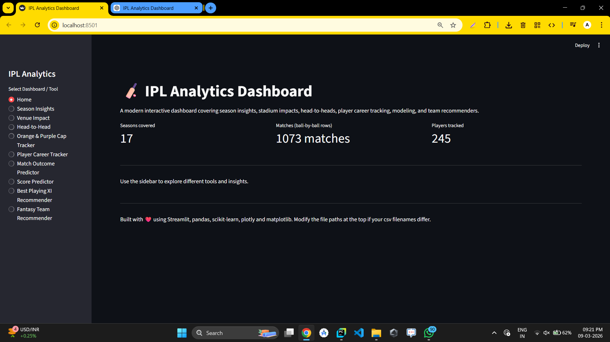
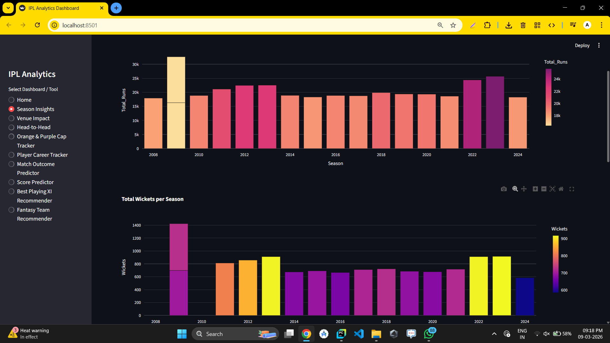
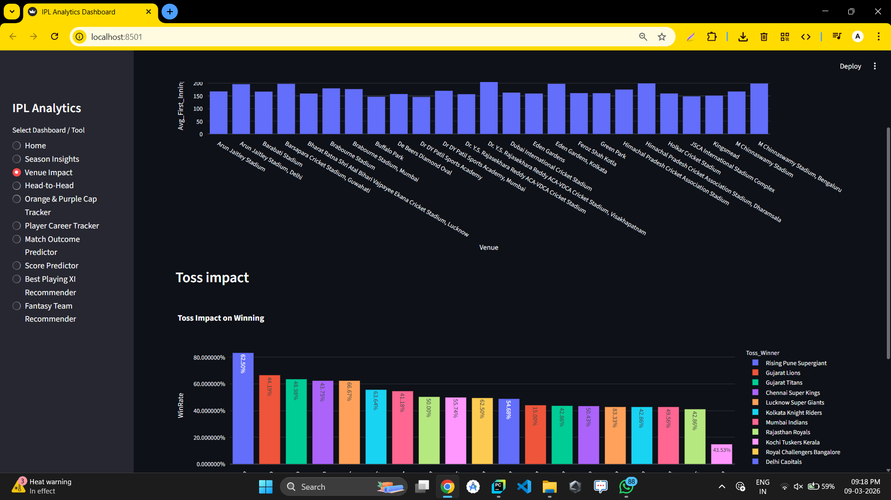
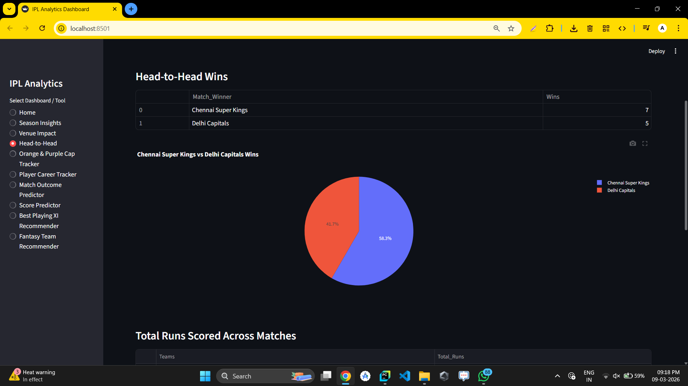
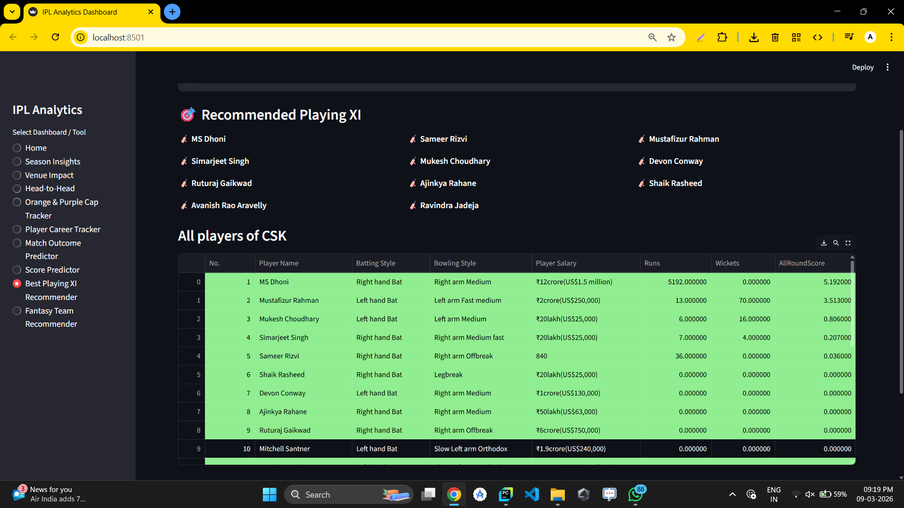

**🏏 IPL Analytics Dashboard**

A **Streamlit-based interactive analytics dashboard** for exploring **IPL cricket data (2008--2024)**.

The application provides **data analysis, visual insights, and machine learning predictions** including:

- Season statistics

- Venue impact analysis

- Head-to-head comparisons

- Orange & Purple cap tracking

- Player career analytics

- Match outcome prediction

- Score prediction

- Best Playing XI recommender

- Fantasy team generator

This project demonstrates **Data Science, Data Visualization, and Machine Learning** using Python.

**📊 Features**

**1️⃣ Season Insights**

Analyze IPL seasons using statistics like:

- Total runs scored per season

- Total wickets per season

- Top batsmen of each season

- Top bowlers of each season

**2️⃣ Venue Impact & Toss Analysis**

Understand how stadiums influence match outcomes.

Features:

- Average first innings score per venue

- Toss winner impact on match results

**3️⃣ Head-to-Head Team Comparison**

Compare any two IPL teams across seasons.

Includes:

- Total wins comparison

- Win percentage

- Total runs across matches

- Top wicket-takers in those matches

**4️⃣ Orange Cap & Purple Cap Tracker**

Track the **best performers in IPL history**.

Displays:

- Top run scorers (Orange Cap race)

- Top wicket takers (Purple Cap race)

- Season-wise leaders

**5️⃣ Player Career Tracker**

Analyze any IPL player\'s career performance.

Shows:

- Season-wise runs

- Season-wise wickets

- Batting style

- Bowling style

**6️⃣ Match Outcome Predictor**

Machine Learning model that predicts **which team will win a match** based on:

- Teams playing

- Venue

- Toss winner

Model Used:

**Random Forest Classifier**

**7️⃣ Score Predictor**

Predicts **first innings score range** for a match using:

- Venue

- Batting team

- Bowling team

Model Used:

**Random Forest Regressor**

**8️⃣ Best Playing XI Recommender**

Automatically selects the **best team lineup** based on:

- Batting performance

- Bowling performance

- All-rounder contribution

**9️⃣ Fantasy Team Recommender**

Generates an **optimal fantasy cricket team** based on:

- Budget

- Player value score

- Historical performance

**🧠 Machine Learning Models Used**

| **Model**                | **Purpose**                 |
|--------------------------|-----------------------------|
| Random Forest Classifier | Predict match winner        |
| Random Forest Regressor  | Predict first innings score |

Libraries used:

- **scikit-learn**

- **pandas**

- **numpy**

- **plotly**

- **seaborn**

**📂 Dataset**

The dashboard uses the following datasets:

IPL_BallByBall2008_2024(Updated).csv  
team_performance_dataset_2008to2024.csv  
Players_Info_2024.csv  
ipl_teams_2024_info.csv

They contain:

- Ball-by-ball IPL data

- Team performance records

- Player information

- Team details

**⚙️ Installation**

**1️⃣ Clone the repository**

git clone https://github.com/AumSheth/IPL-Dashboard.git  
cd IPL-Analytics-Dashboard

**2️⃣ Install dependencies**

pip install pandas numpy matplotlib seaborn scikit-learn streamlit plotly joblib

**3️⃣ Run the application**

streamlit run dashboard2.py

{width="6.268055555555556in" height="3.525in"}{width="6.268055555555556in" height="3.5208333333333335in"}{width="6.268055555555556in" height="3.525in"}{width="6.268055555555556in" height="3.525in"}{width="6.268055555555556in" height="3.525in"}

**🎯 Learning Outcomes**

This project demonstrates:

- Data cleaning and preprocessing

- Data visualization

- Feature engineering

- Machine learning model training

- Model deployment using Streamlit

- Interactive dashboards
